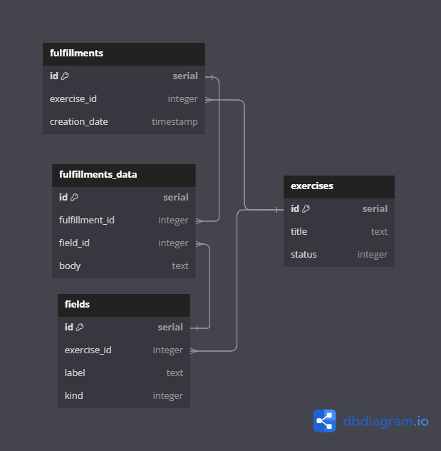

# Database schema

Here is the database structure we want to use, you can use https://dbdiagram.io/ to render the diagram from source code below.



## DBML

```dbml
// Use DBML to define your database structure
// Docs: https://dbml.dbdiagram.io/docs

Table exercises {
  id integer [primary key]
  title text
  status integer //0:Building 1:Answering 2:Closed
}

Table fields {
  id integer [primary key]
  exercise_id integer
  label text
  kind integer // 0:Single line text 1:List of single lines 2:Multi-line text
}

Table fulfillments {
  id integer [primary key]
  exercise_id integer
  creation_date timestamp

}

Table fulfillments_data {
  id integer [primary key]
  fullfilment_id integer
  field_id integer
  body text //raw data with \n to separate lines
}

Ref: fields.exercise_id > exercises.id
Ref: fulfillments.exercise_id > exercises.id
Ref: fulfillments.exercise_id < fulfillments_data.fullfilment_id
Ref: fields.id < fulfillments_data.field_id
```


## Prostgres code generated from the dbml
```sql
CREATE TABLE "exercises" (
  "id" integer PRIMARY KEY,
  "title" text,
  "status" integer
);

CREATE TABLE "fields" (
  "id" integer PRIMARY KEY,
  "exercise_id" integer,
  "label" text,
  "kind" integer
);

CREATE TABLE "fulfillments" (
  "id" integer PRIMARY KEY,
  "exercise_id" integer,
  "creation_date" timestamp
);

CREATE TABLE "fulfillments_data" (
  "id" integer PRIMARY KEY,
  "fullfilment_id" integer,
  "field_id" integer,
  "body" text
);

ALTER TABLE "exercises" ADD FOREIGN KEY ("id") REFERENCES "fields" ("exercise_id");

ALTER TABLE "exercises" ADD FOREIGN KEY ("id") REFERENCES "fulfillments" ("exercise_id");

ALTER TABLE "fulfillments_data" ADD FOREIGN KEY ("fullfilment_id") REFERENCES "fulfillments" ("exercise_id");

ALTER TABLE "fulfillments_data" ADD FOREIGN KEY ("field_id") REFERENCES "fields" ("id");

```